# git-work
Trabajo en equipo de Jose Luis y Agustin

## PASO 1
- `user1` será Agustín Ramírez Figueredo.
- `user2` será Jose Luis Serrat Cano.

## PASO 2

`user1` crea el repositorio **git-work** 

## PASO 3

`user1` clona el repositorio en local

Una vez clonado el repositorio, `user1` añade los archivos y hace el commit y push.

## PASO 4
Como `user2` creo un fork del repositorio git-work de `user1`
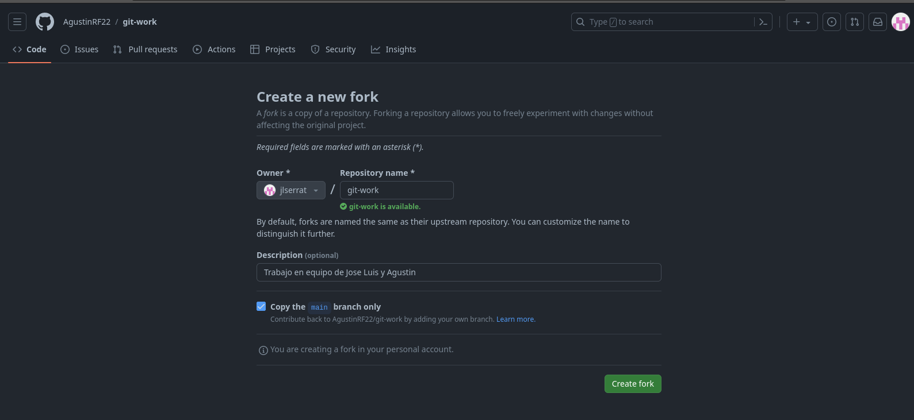
Visualizo y verifico que el fork es correcto y que proviene de `user1`
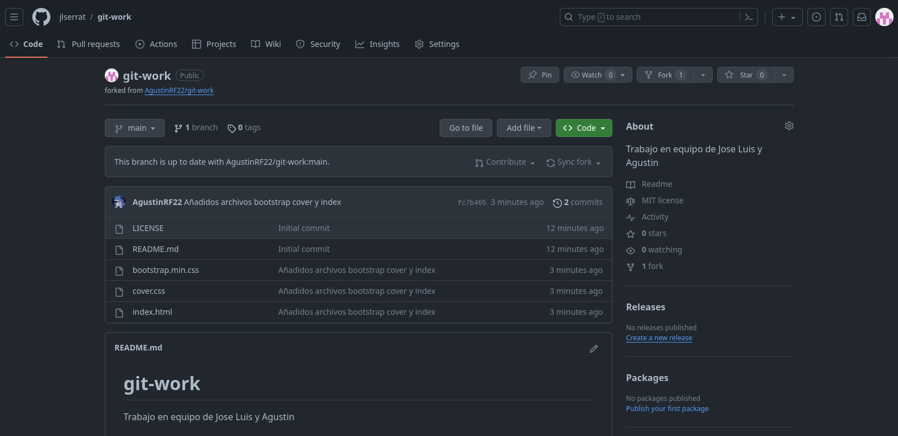

## PASO 5
`user2` copia el SSH para realizar el el clon en local
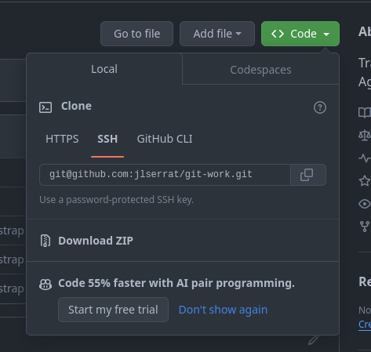
`user2` ejecuta el comando
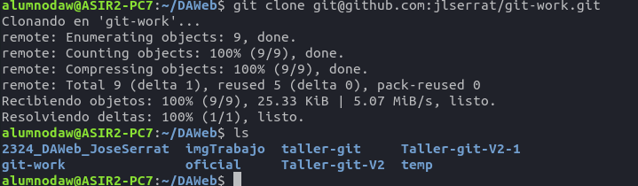

## PASO 6
no hacer

## PASO 7
`user2` crea una nueva rama llamada custom-text
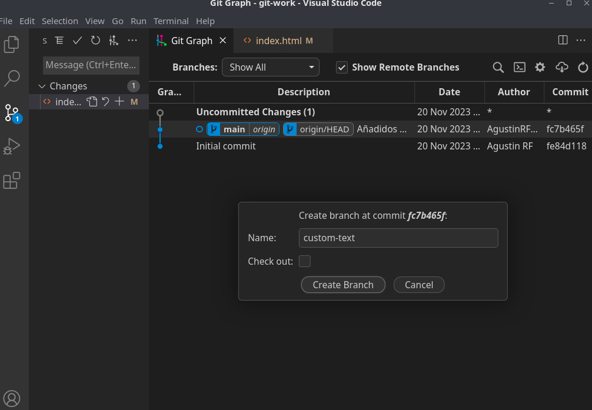
Modificación del index
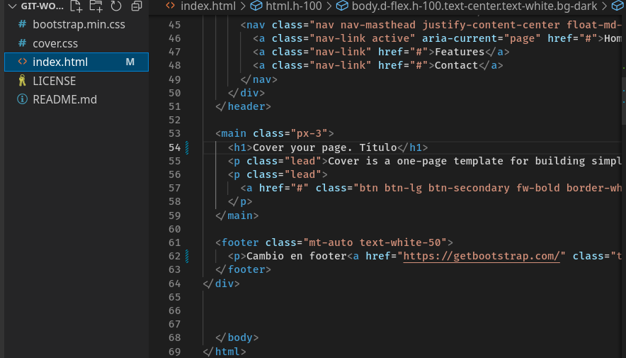
`user2` Comenta los cambios y prepara el push
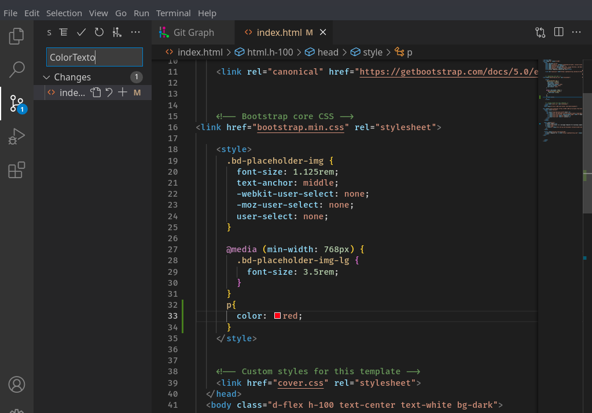
`user2` publica la rama
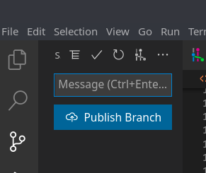

## PASO 8
`user2` Envia pull request a `user1`
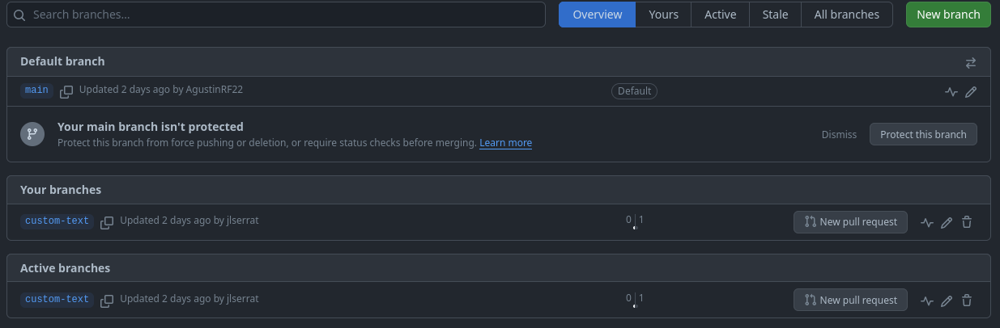
`user2` Visualiza los cambios que ha hecho
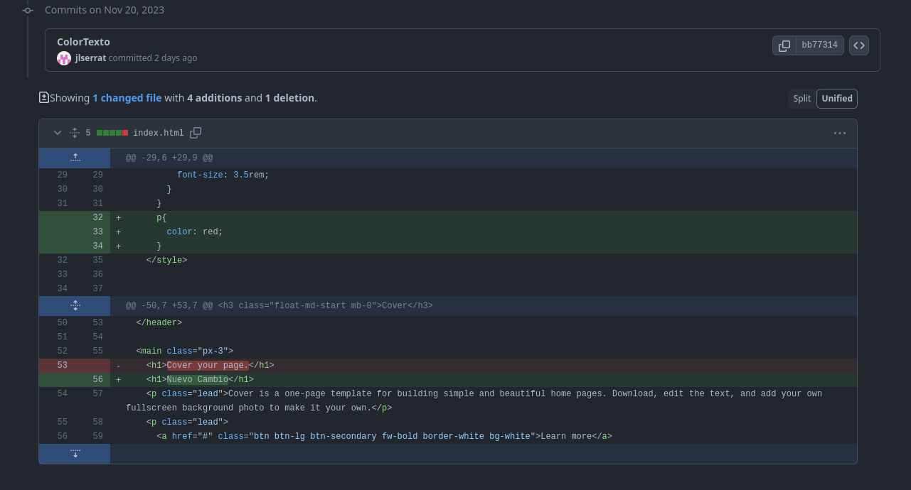
`user2` verifica  que esta marcado Allow edits from maintainers e inicia una conversación
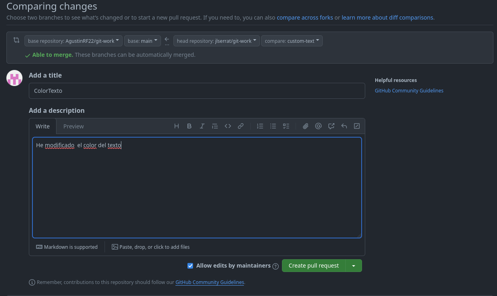

## PASO 9

## PASO 10

## PASO 11

## PASO 12

## PASO 13
paso 13 joseluis

## PASO 14
paso 14 joseluis

## PASO 15
paso 15 joseluis
