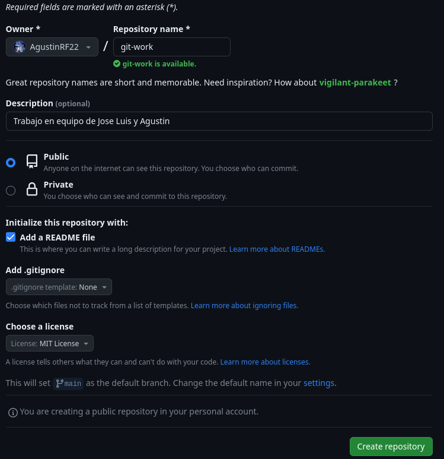
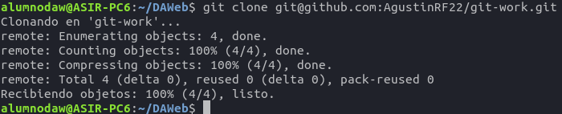
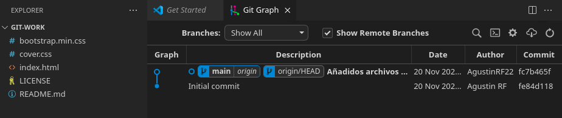

# git-work
Trabajo en equipo de Jose Luis y Agustin

## PASO 1
- `user1` será Agustín Ramírez Figueredo.
- `user2` será Jose Luis Serrat Cano.

## PASO 2

`user1` crea el repositorio **git-work** 

## PASO 3

`user1` clona el repositorio en local

Una vez clonado el repositorio, `user1` añade los archivos y hace el commit y push.

## PASO 4

## PASO 5

## PASO 6

## PASO 7

## PASO 8

## PASO 9

## PASO 10

## PASO 11

## PASO 12

## PASO 13

## PASO 14

## PASO 15

## PASO 16

## PASO 17

